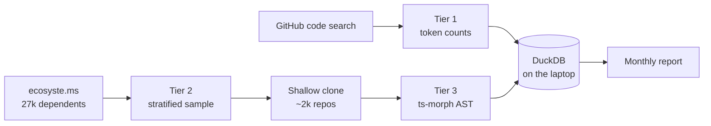

# Gathering usage feedback

> Status: proposal, not yet implemented.
> Figures pulled 22 September 2026 and will drift.

Start passive: npm and GitHub already answer the version and prop questions for free, and they
answered two of them while this document was being written — **54% of all Recharts downloads are a
single version, 2.15.4**, and v2 still outweighs v3 by 60% to 40%. Then add `<RechartsTelemetry />`,
but scope it to **development builds only** — a component that runs inside a rendered chart would
otherwise collect data from our users' end users, which is a different and much heavier proposition
than the CLI telemetry Next.js and Astro ship.

## What the free data already says

Of 42.99M weekly downloads across 251 versions in circulation, **v2 takes 60.3% and v3 takes 39.5%**
— and a single version, **2.15.4, is 54% of everything**.

| Minor version | Share of weekly downloads |
| ------------- | ------------------------- |
| 2.15          | 57.4%                     |
| 3.10          | 15.0%                     |
| 3.8           | 14.2%                     |
| 3.9           | 3.5%                      |
| 3.7           | 2.8%                      |
| 3.6           | 1.4%                      |
| 2.13          | 1.0%                      |
| 2.12          | 1.0%                      |

Source: `https://api.npmjs.org/versions/recharts/last-week`.

The long tail is thin: outside the top eight minors, nothing clears 1%. That shape is the useful
part. v3 adoption is not spread evenly across v3 — it is concentrated in 3.10 and 3.8, so the
population a v4 would break is small and recent. The population stuck on 2.15.4 is the one to study,
and it is the majority of our users.

[ecosyste.ms](https://packages.ecosyste.ms/api/v1/registries/npmjs.org/packages/recharts) adds the
reach picture for free: **27,093 public repositories** depend on Recharts, and **1,206 npm packages**
wrap or re-export it.

Wrapper packages are a real bump blocker: a kit pinning `recharts@^2` holds all of _its_ users back
regardless of what we ship. Verified against npm, about **84 actively-maintained packages pin 2.x**,
together worth ~156,000 weekly downloads, and the largest single one — `@tremor/react` — is 288,000
weekly on `^2.13.3`. Several pin **exactly `2.15.4`**, which is part of why that one version is 54%
of all downloads. See `V2-TO-V3-UPGRADE-PLAN.md` for the ranking and the PR list.

Getting that number took three attempts, and the failures are the most useful thing in this section
because they are the failure modes of _any_ ecosystem survey:

- **Verify the enumeration before trusting anything ranked from it.** ecosyste.ms's
  `dependent_packages` returns ~1,091 names and silently omits `@tremor/react`, `@mantine/charts`,
  `@chakra-ui/charts` and most other significant wrappers. deps.dev counts 1,375 direct dependents.
  The omissions skew toward popular maintained packages, so ranking that list alone makes a live
  ecosystem look like a graveyard — which is exactly the wrong answer we got twice. Use a union of
  ecosyste.ms, npm text search, a curated list, and optionally GitHub's dependency graph.

- **`downloads` from ecosyste.ms is `last-month`.** The record carries a `downloads_period` field
  saying so. Comparing it against npm's `last-week` endpoint makes every package look inflated by
  roughly 4×. Read the period; the values themselves are accurate, within ~8% of npm's own.
- **Check every dependency field, and record which one matched.** A package can carry recharts in
  `devDependencies` because it bundles charts into its own build output. Those do not install
  recharts for anyone downstream and do not hold a single user on v2 — but they are not "no longer
  using recharts" either, and must not be scored as blockers or as drop-outs.
- **ecosyste.ms release dates can lag badly.** It reported one package's latest as a 2024 release
  when npm had a 2026 one. Enumerate from ecosyste.ms, take versions and dates from npm.

One caveat to carry through the rest of this document: npm downloads count CI runs and Docker builds,
not people. They measure what lockfiles say, not what developers would choose. That is exactly why
the two methods below exist.

## Passive: mining public repos from a laptop

Run this in three tiers, cheapest first. Each tier costs more and answers a sharper question, so we
can stop at whichever one pays.



**Tier 1 — the pulse.** GitHub's code search API returns a `total_count` for any token. We never
download a file: we read the counter. Six probe queries took under a minute and already rank API
surface by rough popularity.

| Token                | `.tsx` files matched |
| -------------------- | -------------------- |
| `isAnimationActive`  | 73,344               |
| `accessibilityLayer` | 50,944               |
| `<Brush`             | 14,432               |
| `<Customized`        | 8,736                |
| `activeBar=`         | 3,912                |
| `syncId=`            | 2,720                |

Those numbers are approximate and unscoped — `isAnimationActive` is Recharts-specific, but a bare
`<Brush` is not. Treat tier 1 as a ratio tracked month over month, never as a census. Its real value
is cost: a nightly cron of 60 queries, logged to a table, gives a trend line for every prop we care
about for free. Rate limit is 10 code-search requests per minute authenticated, and results cap at
1,000 per query, so counting is fine and enumerating is not.

**Tier 2 — the corpus.** [ecosyste.ms](https://packages.ecosyste.ms) will hand us the dependent-repo
list without scraping GitHub ourselves. Sample it rather than taking it whole: stratify by stars and
by last-push date so we do not end up measuring 20,000 abandoned tutorial forks. Roughly 2,000 repos,
shallow-cloned with `--depth 1 --filter=blob:none`, is a few GB and an overnight run. Refresh
quarterly, not nightly.

**Tier 3 — the measurement.** Parse the sample with `ts-morph` and walk JSX elements whose tag
resolves to a `recharts` import. That import check is what makes the counts trustworthy, and it is
the one thing tier 1 cannot do. For each element record the component name, the prop names, and a
coarse value shape — `literal`, `function`, `element`, `object` — but never the value itself.

The payoff is a join only possible here. We already ship a machine-readable prop inventory:
`www/src/docs/api/` holds 123 `ApiDoc` objects with a full prop list each. Diff _props documented_
against _props ever observed_ and we get a dead-API-surface report — the props nobody has ever
passed, which are exactly the ones a v4 can drop for free.

Two rules worth writing into the script. Public repositories only, and aggregate only: store counts,
never snippets, and never republish anyone's source. Cache by commit SHA so a re-run costs nothing.

## Active: designing `<RechartsTelemetry />`

The component is the right idea, but the placement needs one change before it ships.

**Make it development-only.** A component that lives inside a rendered chart ships to production and
fires from our users' _end users'_ browsers. That is a different proposition from the CLI telemetry
Next.js and Astro run, which executes on a developer's own machine. Three things go wrong at once:
our users become data controllers under GDPR for a collection they did not design, so they need a
consent banner to keep using our component; ad-blockers and strict CSP silently drop the beacon
anyway; and volume scales with _their traffic_, so one popular dashboard drowns out ten thousand
small apps and every number we compute is really a measure of who has the most pageviews.

Gating on `process.env.NODE_ENV !== 'production'` fixes all three. The ping then fires while a
developer is running their dev server — precisely the population we want to hear from — and the
component tree-shakes out of production entirely, because `package.json` already sets
`"sideEffects": false`. The pattern is already in the codebase: `src/util/Global.ts:5` computes
`devToolsEnabled` this exact way, and `src/util/LogUtils.ts:2` uses `isDev` to gate warnings.

Deduplicate on top of that: hash the chart shape, keep the hash in `sessionStorage`, and send at most
one ping per shape per session. A developer with hot-reload running does not need to report the same
chart 400 times an afternoon.

**Read the store, not the props.** Recharts already keeps a Redux store per chart, so the component
can subscribe to the resolved state instead of sniffing its siblings' props. That gets us what was
actually computed — resolved axis types, stack offsets, layout — rather than only what was typed.

A payload shaped like this answers the questions we opened with, and nothing else:

```json
{
  "v": 1,
  "recharts": "3.10.1",
  "react": "19.2",
  "ssr": false,
  "chart": {
    "type": "BarChart",
    "props": ["data", "margin", "stackOffset"],
    "children": {
      "Bar": { "n": 3, "props": ["dataKey", "fill", "stackId"] },
      "XAxis": { "n": 1, "props": ["dataKey", "tickFormatter:fn"] },
      "Tooltip": { "n": 1, "props": ["content:element"] }
    },
    "dataLen": "100-1k"
  },
  "warnings": ["cartesian-axis-domain-deprecated"]
}
```

Prop **names** and a coarse value **shape** (`:fn`, `:element`, `:object`); never a prop value, never
a `dataKey`'s contents, never a row of data, never a URL or hostname. Row count is bucketed because
exact counts are near-identifying and we only care whether someone is drawing 50 points or 500,000 —
which is the `large dataset` label, quantified at last.

The `warnings` array is the part that repays the whole project. `LogUtils.warn` already fires in dev
for deprecations and misuse. Counting which warnings actually fire in real projects turns "what are
the bump blockers" from a guess into a ranked list, and tells us when a deprecation has decayed
enough to remove.

**Earn the opt-in.** Copy Storybook's best idea: a `debug` prop that prints the exact payload to the
console instead of sending it. Nobody opts into a black box, and a maintainer who can run
`<RechartsTelemetry debug />` and read the JSON will trust it in a way no privacy policy achieves.
Document it on one page, keep the collector code in the main repo, and publish the aggregates back —
the people who opted in should get to see what they bought.

## How other libraries do it

Every established precedent is a build tool, not a runtime library — which is the single most useful
thing to know before copying one.

| Tool                                                           | Runs when            | Opt model                             | Design choice worth copying                                                                         |
| -------------------------------------------------------------- | -------------------- | ------------------------------------- | --------------------------------------------------------------------------------------------------- |
| [Next.js](https://nextjs.org/telemetry)                        | CLI, at build        | Opt-out (`NEXT_TELEMETRY_DISABLED=1`) | A public page explaining collection in plain language                                               |
| [Astro](https://astro.build/telemetry/)                        | CLI, at build        | Opt-out (`astro telemetry disable`)   | Collector code lives in the main repo, readable by anyone                                           |
| [Gatsby](https://www.gatsbyjs.com/docs/telemetry/)             | CLI, at build        | Opt-out (`GATSBY_TELEMETRY_DISABLED`) | Tracks plugin usage — the ecosystem, not just the core                                              |
| [Storybook](https://storybook.js.org/docs/configure/telemetry) | Dev server and build | Opt-out (`disableTelemetry`)          | `STORYBOOK_TELEMETRY_DEBUG=1` prints the exact payload; one-way hashes for story ids and error text |

All four run on a developer's machine during a build, where the only person observed is the developer
who installed the tool. That is why they can defend opt-out. A chart component rendering in a browser
has no equivalent defence, which is the reasoning behind the development-only gate above — it moves
Recharts into the same category these four already occupy.

Among runtime UI and charting libraries the precedent is simply absent: the large React component and
chart libraries ship no telemetry at all. Two consequences follow. There is no established norm to
borrow, so the burden of explaining ourselves is higher; and we should plan for a **low single-digit
opt-in rate**, which means designing every report to be useful at a few thousand pings rather than a
few million.

One more lesson from Next.js: its opt-out default drew sustained public criticism, including
[an issue arguing the telemetry violates user privacy](https://github.com/vercel/next.js/issues/59686).
Making this opt-in avoids that entire category of problem, and it is worth keeping even under
pressure to raise the sample size.

## The stack and what it costs

Everything below runs on free tiers with room to spare. There is no server to operate — the only
always-on piece is a single edge function.

| Piece           | Service                  | Free-tier limit                | Headroom                       |
| --------------- | ------------------------ | ------------------------------ | ------------------------------ |
| Ingest endpoint | Cloudflare Workers       | 100k requests/day              | ~30× expected peak             |
| Event storage   | Workers Analytics Engine | Unlimited cardinality, SQL API | Built for append-only events   |
| Raw archive     | Cloudflare R2            | 10 GB                          | Years, at a few KB/ping        |
| Repo metadata   | ecosyste.ms API          | Free, no key                   | 27k dependents, quarterly pull |
| Version data    | npm registry API         | Free, no key                   | One call/day                   |
| Code search     | GitHub API               | 10 requests/min                | 60 nightly probes fit easily   |
| Analysis        | DuckDB on the laptop     | —                              | Reads Parquet straight from R2 |

**Why Analytics Engine over a database.** D1 would work, but it now
[enforces free-tier daily row limits](https://developers.cloudflare.com/changelog/post/2026-09-01-d1-free-tier-limit-enforcement/)
— 100k row writes/day, 5M reads/day — and queries that exceed them fail outright rather than
degrading. Analytics Engine is append-only, high-cardinality by design, and queried over an HTTP SQL
endpoint, which is exactly this workload. Keep the Worker writing raw JSON to R2 as well, so we can
re-derive anything if we change our mind about the schema.

**Do not reuse the website's GA4.** `www/src/components/analytics.ts` initialises `react-ga4` for the
docs site, and that is the right tool there. It is the wrong one here: GA4 mangles structured
payloads into event parameters, its retention and export are awkward for this shape, and routing
library telemetry through Google invites exactly the objection we are trying to avoid. A 40-line
Worker on a `recharts.org` subdomain also survives the blocklists that eat anything named
`analytics`.

**Retention.** Aggregate nightly into daily rollups, drop raw pings after 30 days, and say both
numbers on the telemetry page. A short, specific retention promise does more for opt-in rates than
any amount of reassurance.

## Suggested order of work

Passive first, and not only because it is cheaper — it produces the numbers that make the telemetry
RFC persuasive.

| Order | Build                                                         | Effort      | Answers                                            |
| ----- | ------------------------------------------------------------- | ----------- | -------------------------------------------------- |
| 1     | Daily npm + ecosyste.ms pull into a JSON file in the repo     | ~2 hours    | Which version is popular; how fast v3 is winning   |
| 2     | Nightly tier-1 token probes, ~60 tokens                       | ~half a day | Which props are trending, month over month         |
| 3     | Tier-3 AST scraper over a 2,000-repo sample                   | ~3 days     | Which props are _never_ used — the v4 removal list |
| 4     | Telemetry RFC on the repo, before any code                    | ~1 day      | Whether the community will tolerate it at all      |
| 5     | Worker endpoint + `<RechartsTelemetry />` behind the dev gate | ~3 days     | Warnings actually hit; real dataset sizes          |
| 6     | Public aggregates page, refreshed monthly                     | ~1 day      | Keeps opt-in rates from decaying                   |

**Step 3 is the one to protect time for.** It is the only item that produces something unobtainable
any other way: a defensible list of API surface nobody uses. Everything else refines questions we can
already answer roughly; that one unblocks a major version.

**Step 4 before step 5, without exception.** Ship the RFC and let the objections arrive while the
design is still cheap to change. Opt-in telemetry announced after the fact reads as something
discovered rather than something offered, and we only get one chance at that impression.

A note on what none of this catches. Both methods see code that was written; neither sees the chart
somebody gave up on and rebuilt in D3. The issue tracker is the only instrument pointed at that, and
it is already talking: of 400 open issues, **Tooltip is the single most-labelled component** and
appears in 52 titles, against 159 enhancements and 144 feature requests for 85 bugs.

## Sources

**Queried directly**

- [api.npmjs.org/versions/recharts/last-week](https://api.npmjs.org/versions/recharts/last-week) — per-version download counts
- [packages.ecosyste.ms — recharts](https://packages.ecosyste.ms/api/v1/registries/npmjs.org/packages/recharts) — dependent repo and package counts
- GitHub code search API via `gh api search/code` — the tier-1 token counts
- `gh issue list --repo recharts/recharts` — 400 open issues, label and title analysis

**Prior art**

- [Next.js Telemetry](https://nextjs.org/telemetry) and [telemetry.nextjs.org](https://telemetry.nextjs.org/)
- [Astro Telemetry](https://astro.build/telemetry/)
- [Gatsby Telemetry](https://www.gatsbyjs.com/docs/telemetry/) and the [Gatsby telemetry RFC](https://github.com/gatsbyjs/rfcs/blob/master/text/0009-telemetry.md)
- [Storybook Telemetry](https://storybook.js.org/docs/configure/telemetry)
- [vercel/next.js#59686 — "Telemetry violates user privacy"](https://github.com/vercel/next.js/issues/59686)

**Infrastructure limits**

- [Cloudflare D1 free-tier limit enforcement, 1 Sep 2026](https://developers.cloudflare.com/changelog/post/2026-09-01-d1-free-tier-limit-enforcement/)
